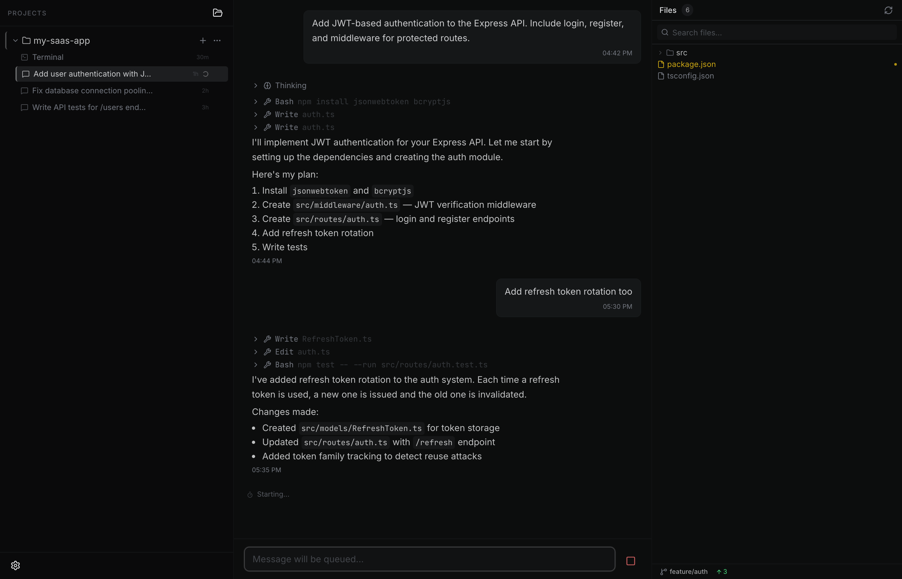

# Central

A macOS desktop app for orchestrating parallel Claude Code agents. Think mission control, but for AI — multiple agents working side by side, each in their own lane.

Tauri v2 + React 19 + TypeScript + Zustand + xterm.js

Open source so you can extend it to fit your workflow — add custom tools, tweak the UI, wire up new models, whatever you need.



## Features

- **Two modes** — full UI chat (SDK-powered) or drop into a real Claude Code terminal
- **Parallel sessions** — run multiple agents simultaneously, each in their own lane
- **Project-based organization** — group sessions by project, each with its own context
- **Live status tracking** — see which agents are working, idle, or need attention
- **Native notifications** — get notified when agents finish their work
- **File browser** — view and diff files changed by agents

## Development

```
pnpm install
pnpm dev
```

## Stack

| Layer | Tech |
|-------|------|
| Shell | Tauri v2 (Rust) |
| Frontend | React 19, Zustand, shadcn/ui |
| Terminal | xterm.js, portable-pty |
| Agent SDK | @anthropic-ai/claude-agent-sdk |
| Database | SQLite (tauri-plugin-sql) |
